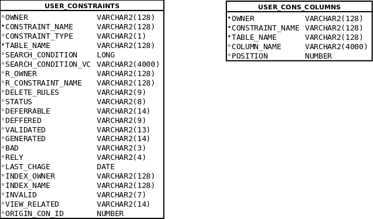

# Tutorium - Grundlagen Datenbanken - Blatt 6

## Vorbereitungen
* Für dieses Aufgabenblatt wird die SQL-Dump-Datei `01_tutorium.sql` benötigt, die sich im Verzeichnis `sql` befindet.
* Die SQL-Dump-Datei wird in SQL-Plus mittels `start <Dateipfad/zur/sql-dump-datei.sql>` in die Datenbank importiert.
* Beispiele
  * Linux `start ~/Tutorium.sql`
  * Windows `start C:\Users\max.mustermann\Desktop\Tutorium.sql`

## Datenbankmodell


## Data-Dictionary-Views


## Aufgaben

### Aufgabe 1
Wie heißt der Primary Key Contraint der Tabelle `VEHICLE` und für welche Spalten wurde er angelegt?

#### Lösung
```sql
SELECT ucc.constraint_name, ucc.column_name, ucc.position
FROM User_Cons_Columns ucc
WHERE constraint_name IN(
SELECT constraint_name
FROM user_constraints uc
WHERE uc.table_name LIKE 'ACC_VEHIC'
AND uc.constraint_type ='P');
```

### Aufgabe 2
Für welche Spalte**n** der Tabelle `ACC_VEHIC` wurde ein Foreign Key angelegt und auf welche Spalte/n in welcher Tabelle wird er referenziert?

#### Lösung
```sql
COLUMN constraint_name FORMAT a25
COLUMN column_name FORMAT a15
COLUMN table_name FORMAT a15

SELECT ucc.constraint_name, ucc.column_name, ucc.table_name
FROM User_Cons_Columns ucc
WHERE constraint_name IN(
SELECT constraint_name
FROM user_constraints uc
WHERE uc.table_name LIKE 'ACC_VEHIC'
AND uc.constraint_type ='R');
```

### Aufgabe 3
Erstelle einen Check Constraint für die Tabelle `ACCOUNT`, dass der Wert der Spalte `U_DATE` nicht älter sein kann als `C_DATE`.

#### Lösung
```sql
-- Constraint
ALTER TABLE ACCOUNT ADD CONSTRAINT c_date
CHECK (u_date >= c_date);

--Überprüfung
UODATE account
SET u_date = TO_DATE('2014-11-13,YYYY-MM-DD')
WHERE Account_id =1;
```

### Aufgabe 4
Erstelle einen Check Constraint der überprüft, ob der erste Buchstabe der Spalte `GAS_NAME` der Tabelle `GAS` groß geschrieben ist.

#### Lösung
```sql
ALTER TABLE gas
ADD CONSTRAINT u_gas_name
CHECK (gas_name =INITCAP(gas_name));

-- Alternative
ALTER TABLE gas
ADD CONSTRAINT u_gas_name_alternative
CHECK (REGEXP_LIKE(gas_name, '^[A-Z].*$'));
```

### Aufgabe 5
Erstelle einen Check Contraint der überprüft, ob der Wert der Spalte `IDENTICATOR` der Tabelle `ACC_VEHIC` eins von diesen möglichen Fahrzeugkennzeichenmustern entspricht. Nutze Reguläre Ausdrücke.

+ B:AB:5000
+ TR:MP:1
+ Y:123456
+ THW:98765
+ MZG:XZ:96

#### Lösung
```sql
alter table acc_vehic
add constraint c_kennzeichen_entspricht
check(regexp_like(identicator, '^[A-Z]{1-3}:([A-Z]{1-2}:[1-9][0-9]{0,3}|[1-9][0-9]{0,5})$','c'));
```

### Aufgabe 6 - Wiederholung
Liste für alle Personen den Verbrauch an Kraftstoff auf (Missachte hier die unterschiedlichen Kraftstoffe). Dabei ist interessant, wie viel Liter die einzelne Person getankt hat und wie viel Euro sie für Kraftstoffe ausgegeben hat.

#### Lösung
```sql
Deine Lösung
```

### Aufgabe 7 - Wiederholung
Liste die Tankstellen absteigend sortiert nach der Kundenanzahl über alle Jahre.

#### Lösung
```sql
Deine Lösung
```

### Aufgabe 8 - Wiederholung
Erweitere das Datenbankmodell um ein Fahrtenbuch, sowie es Unternehmen für ihren Fuhrpark führen. Dabei ist relevant, welche Person an welchem Tag ab wie viel Uhr ein Fahrzeug für die Reise belegt, wie viele Kilometer zurück gelegt wurden und wann die Person das Fahrzeug wieder abgibt.

Berücksichtige bitte jegliche Constraints!

#### Lösung
```sql
Deine Lösung
```


